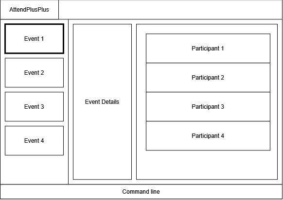

# AttendPlusPlus

## About AttendPlusPlus

AttendPlusPlus is a desktop application for event organisers to manage
events, participants, and attendance in one place. It combines command-line
input with a graphical interface to help organisers access and manage
event information efficiently.

The planned MVP includes:

* Creating, listing, viewing, searching, and deleting events.
* Adding, listing, viewing, searching, and deleting participants within an event.
* Finding participants by name or role.
* Marking participants as present and keeping track of attendance.
* Saving event, participant, and attendance data between sessions.
* Displaying command results in the GUI and showing command hints when
  hovering over actionable controls.

For project documentation, visit the
[AttendPlusPlus website](https://ay2627s1-cs2103-f12-4.github.io/tp/).

## Acknowledgements

This project is based on the AddressBook-Level3 project created by the
[SE-EDU initiative](https://se-education.org).
