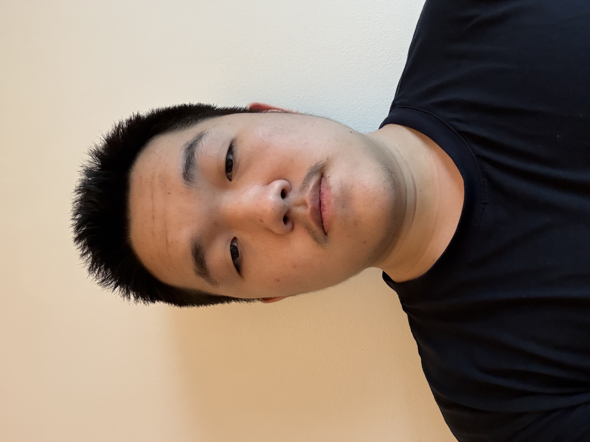
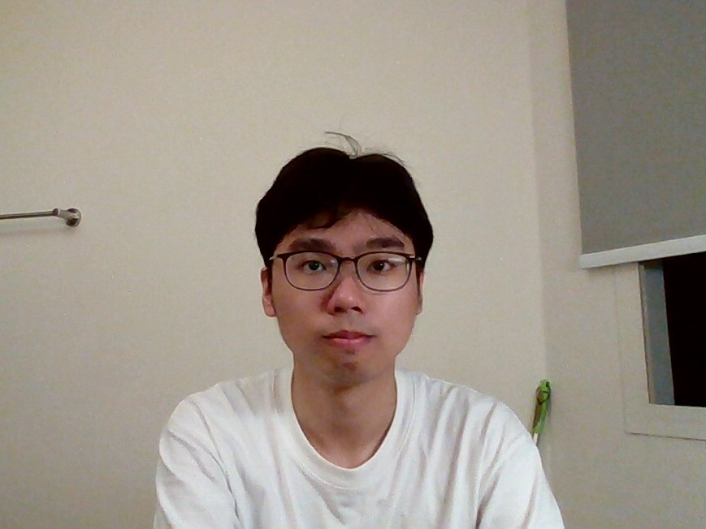

# About Us

We are a team based in the [School of Computing, National University of Singapore](http://www.comp.nus.edu.sg).

You can reach us at the email `seer[at]comp.nus.edu.sg`

## Project team

### MathRat190225

[[github](https://github.com/MathRat190225)]

* Role: Code quality
* Responsibilities: In charge of Logic

### Ong Sheng Hao

[[github](https://github.com/ShengHaozz)]

* Role: Integration

### Tan Yi Xuan

[[github](https://github.com/tanyxuan)]
* Role: Developer
* Role: Testing and QA
* Role: Documentation

### Chye Xian Zhe

[[github](http://github.com/xian-zhe)]
* Role: Developer
